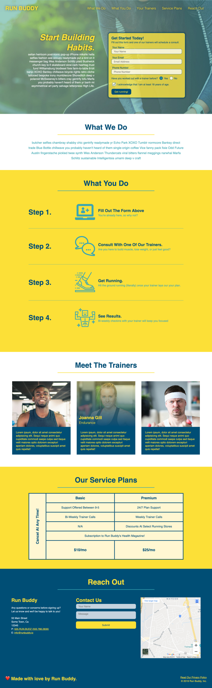

# Run Buddy 2.0

This site was designed to help me to understand and code HTML5, CSS and Git. During this challenge I was tasked with refactoring existing code to bring it up to a more accessible standard.

While updating the site I found a broken link in the code that was fixed as well as several images that did not contain alt tags for accessibility that I also corrected.

While examining the site I noticed that on smaller view screens, the text in several of the containers would break out past the visual boundaries designed for the content so I took some time to fix this issue and ultimately made the site much more consistent across smaller and larger view screens.

I learned the importance of clean code and while updating the site was able to remove a number of duplicate css rules. Overall this was a fun project and really helped sharpen my skills as a developer.

## Built With
* HTML
* CSS

## Site Location

[Run Buddy 2.0](https://russtracy.github.io/Run-Buddy-2/)

## Contribution
Made with ❤️ by [Russ Tracy]

## Site Image

### ©️2020 Run Buddy, Inc 
